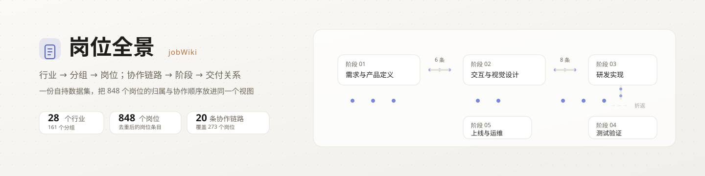
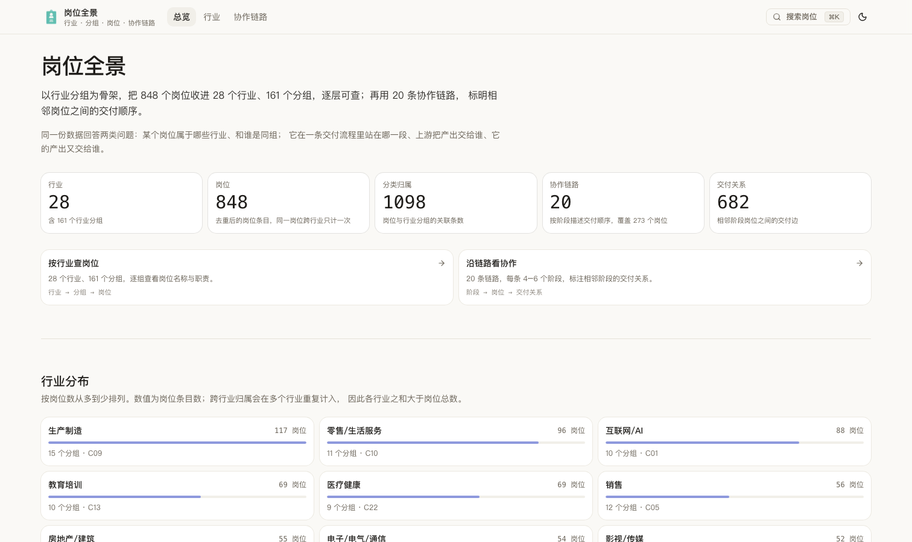
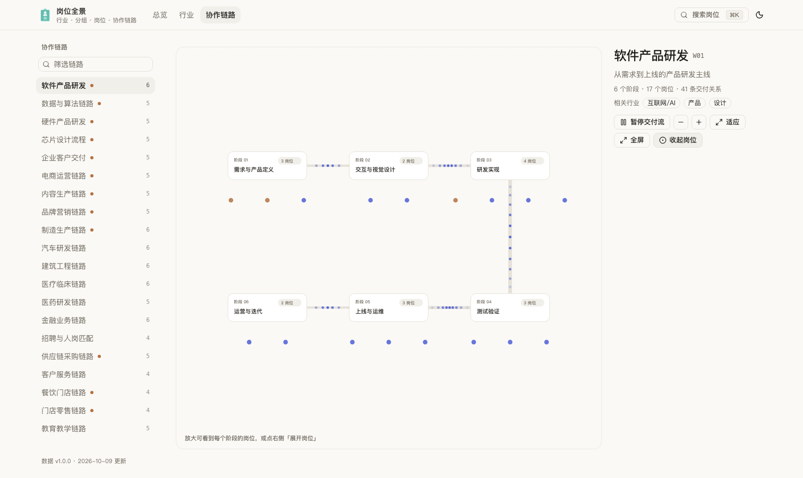

<p align="center">
  
</p>

# 岗位全景（jobWiki）

一份自持的岗位数据集，加一个以「行业结构」和「协作顺序」两条线索展开的静态站点。

岗位不是孤立条目：它属于某个行业与分组，也可能落在一条交付链路的某一个阶段。项目用 28 个行业、161 个分组、848 个岗位与 20 条协作链路回答两件事：

- **它属于哪里** —— 一个岗位归在哪些行业、和谁同组，为什么同一个岗位会出现在几个行业里；
- **它站在哪一段** —— 在一条从需求到交付的流程里，上游把产出交给谁、它的产出又交给谁。

项目不做招聘、投递或求职撮合，页面里没有任何出站链接，也不含第三方平台的编码或标识。

## 四个视图

顶栏是唯一的一级导航；左侧侧栏随视图切换，只呈现与当前视图相关的清单。

| 视图 | 回答的问题 | 侧栏 |
| --- | --- | --- |
| **总览** `/` | 数据集规模、口径与入口 | 不显示 |
| **从哪开始** `/start` | 三条使用路径：还没入行 / 想换方向 / 找位置感 | 不显示 |
| **行业** `/c` | 行业 → 分组 → 岗位的三级结构 | 行业清单（可筛选，当前行业高亮） |
| **协作链路** `/workflow` | 每条链路 4–6 个阶段的交付顺序 | 链路清单（可筛选，含跨链路岗位的链路带标记） |

岗位页 `/job/J0001` 是跨视图的落点：顶部给「当前岗位」块，下面是所属行业清单，以及**只和它相关的链路**（未纳入链路的岗位显示空态）。

全局搜索是 ⌘K / Ctrl+K：空查询时给出四个视图入口，输入关键词则在 848 个岗位里按名称、职责、行业、分组、所在链路与阶段匹配（搜「测试验证」这类阶段名也能找到岗位）。

## 界面

### 总览：规模与口径



### 协作链路：画布上的交付流



链路画布把信息分成三层，从浅到深：

1. **默认视角**只有阶段节点与交付条数，段与段之间的色带按交付关系数填充；
2. **放大**（或点右侧「展开岗位」）出现岗位节点，再放大出现岗位名与岗位级连线；
3. **悬停**任一岗位会高亮它的上游/下游路径，**点击**阶段、岗位或交接口，右栏给出对应明细（岗位职责、上游与下游、谁交给谁）。

画布支持拖拽平移、滚轮缩放、适应画布与全屏查看；交付流可暂停/播放，系统开启「减少动效」时自动静止。

岗位页在三层结构之上再给两条横向线索：

- **跨行业复用**：`N 条归属 · 出现在 X 个行业 · Y 条协作链路`，并列出所在链路；
- **职责相近的岗位**：按职责描述的用词接近程度列出 5 个岗位，用来横向发现"在做类似事情"的岗位。

## 数据规模与口径

| 指标 | 数值 | 口径 |
| --- | --- | --- |
| 行业 | 28 | 含 161 个行业分组 |
| 岗位 | 848 | 去重后的岗位条目，同一岗位跨行业只计一次 |
| 分类归属 | 1098 | 岗位与行业分组的关联条数 |
| 协作链路 | 20 | 每条链路 4–6 个阶段 |
| 交付关系 | 682 | 相邻阶段岗位之间的交付边 |
| 链内岗位 | 273 | 其余岗位只按行业归类，尚未接入链路 |
| 跨行业岗位 | 221 | 归属覆盖 2 个以上**行业**（同一行业的两个分组只算一个） |

岗位 id 形如 `J0001`，分类形如 `C07`，分组形如 `C07-G02`，链路形如 `W01`；id 一经分配不再变更。分类体系、岗位名称与职责描述为本项目整理的内容。

## 页面与路由

| 路由 | 页面 |
| --- | --- |
| `/` | 总览：规模、口径、行业与链路入口 |
| `/start` | 从哪开始：三条使用路径与数据边界说明 |
| `/c` · `/c/C01` | 行业一览 · 单个行业（分组与岗位卡片，带即时过滤） |
| `/workflow` · `/workflow/W01` | 链路一览（赛道式迷你流程）· 单条链路的画布视图 |
| `/job/J0001` | 岗位：职责、所属行业与分组、协作位置、上游/下游、同组岗位 |
| `/sitemap.xml` · `/robots.txt` | 900 条 URL 与爬虫声明 |

所有动态路由都用 `generateStaticParams` + `dynamicParams = false` 全量预渲染，线上是纯静态产物。

## 本地运行

需要 Node 22.18+（原生执行 `.mts` 脚本），仓库用 `.nvmrc` 固定 24。

```sh
pnpm install
pnpm dev            # http://localhost:3000
```

## 常用命令

| 命令 | 作用 |
| --- | --- |
| `pnpm data:check` | 校验 `data/jobs.json`：id 唯一、分类与链路引用、单链路阶段唯一，并断言 `relations` 与 `meta.counts` |
| `pnpm data:sync` | 改过 `workflows` 后，重写派生的 `relations` 与 `meta.counts` |
| `pnpm data:index` | 重新生成 `public/search-index.json`（`predev` / `prebuild` 自动执行） |
| `pnpm lint` · `pnpm typecheck` | eslint · `tsc --noEmit` |
| `pnpm build` · `pnpm start` | 生产构建 · 本地起生产服务 |
| `pnpm test:e2e` | 构建后跑 Playwright 冒烟（chromium） |
| `PLAYWRIGHT_BASE_URL=https://<域名> pnpm exec playwright test` | 同一套用例直接打线上地址 |

## 项目结构

```text
app/                     路由：总览 / 行业 / 协作链路 / 岗位，含 sitemap、robots、icon
components/
  sidebar-nav.tsx        随视图切换的侧栏（行业清单 / 链路清单 / 岗位上下文）
  workflow-canvas.tsx    链路画布：布局、命中、交付流动画、明细面板
  ui/                    shadcn/ui 组件（Base UI 风格），保持贴近上游
lib/
  data.ts                数据访问层（服务端专用）：索引与查询
  related.ts             职责文本相近岗位（字符二元组 TF-IDF，构建期算一次）
  primary-nav.ts         一级视图定义，顶栏 / 抽屉 / ⌘K 共用
  canvas.ts              画布纯函数（视口、圆角矩形、贝塞尔取点、主题取色）
  use-canvas-viewport.ts 画布平移缩放交互
data/jobs.json           唯一数据源
scripts/                 check-data.mts · build-search-index.mts
docs/                    README 头图与截图
tests/smoke.spec.ts      Playwright 冒烟
```

## 数据模型

```json
{
  "meta": { "version": "1.0.0", "updated": "2026-10-09", "counts": {} },
  "categories": [
    {
      "id": "C01",
      "name": "互联网/AI",
      "groups": [{ "id": "C01-G01", "name": "后端开发", "jobs": ["J0001", "J0002"] }]
    }
  ],
  "jobs": [{ "id": "J0001", "name": "Java", "duty": "……" }],
  "hot": ["J0001"],
  "workflows": [
    {
      "id": "W01",
      "name": "软件产品研发",
      "description": "从需求到上线的产品研发主线",
      "industries": ["C01"],
      "stages": [{ "id": "W01-S01", "name": "需求与产品定义", "jobs": ["J0129"] }]
    }
  ],
  "relations": [{ "from": "J0129", "to": "J0001", "workflow": "W01", "type": "handoff" }]
}
```

几个关键约束：

- 岗位只在 `jobs` 里存一份，分类与分组通过 id 引用，因此跨行业归属不会产生重复记录；
- 一个岗位在**同一条链路里只出现在一个阶段**；`relations` 是**生成字段**，由相邻阶段派生，只能通过 `pnpm data:sync` 重写，不要手工编辑；
- 交付关系只表示方向，不表示频率、时长或协作强度。

改数据的流程：编辑 `data/jobs.json` → 若动过 `workflows` 跑 `pnpm data:sync`，否则跑 `pnpm data:check` → `pnpm dev` 确认页面与 `meta.counts` 一致。

## 设计约定

- **零外部请求**：不引 webfont（用系统字体栈），不使用第三方 CDN 或图表库。Vercel Web Analytics 与 Speed Insights 只在生产环境注入同源脚本（`/_vercel/insights/*`、`/_vercel/speed-insights/*`），本地与预览不加载。
- **主题**：`html[data-theme="light|dark"]` + `localStorage['job-explorer-theme']`，首屏前内联脚本写入，默认跟随系统；画布取色读同一套 CSS token。
- **服务器组件优先**：只有搜索、主题、筛选、画布等需要交互的部分加 `"use client"`；`lib/data.ts` 不进客户端包，客户端只接收精简 props。
- **可访问性**：画布本身读屏不可达，因此画布视图保留等价的文本层（阶段、岗位、交付条数），键盘与检索工具可用。
- **派生指标都有口径**：「跨行业」= 去重后的行业数 ≥ 2；「职责相近」= 职责文本相似度排序，**不代表岗位等价或要求相同**；链路起点只是流程位置，**不等于门槛更低**；流程相邻也不代表技能要求相近。页面上的这些说明不要删。

**CI 与验收**：`.github/workflows/ci.yml` 在 push 与 PR 上跑 `data:check → lint → typecheck → build → Playwright`；冒烟覆盖首页统计与入口、行业过滤、岗位上下游与同组、链路画布（缩放 / 平移 / 展开岗位 / 明细）、⌘K 跳转、侧栏随视图切换与岗位上下文、主题持久化、零出站链接，以及线上可观测性脚本同源加载。

## 部署

站点部署在 Vercel（项目 `job-wiki`，框架自动识别 Next.js，Node 24）：推送到 `main` 即自动构建，生产域名为 <https://job-wiki-jet.vercel.app>。如需换域名，在 Vercel 配置 `NEXT_PUBLIC_SITE_URL`，`lib/site.ts` 会用它生成 canonical、sitemap 与 robots。

## 参与贡献

欢迎补充岗位、修正职责描述、调整行业归属或新增协作链路。约定见 [AGENTS.md](./AGENTS.md)：数据改动请说明受影响的行业或岗位与更新后的 `meta.counts`，界面改动请附截图。

## 授权

代码采用 [MIT](./LICENSE)。`data/jobs.json` 中的分类体系与职责描述为本项目整理的内容；如需为数据单独指定授权（例如 CC BY-SA），以本节的说明为准。
